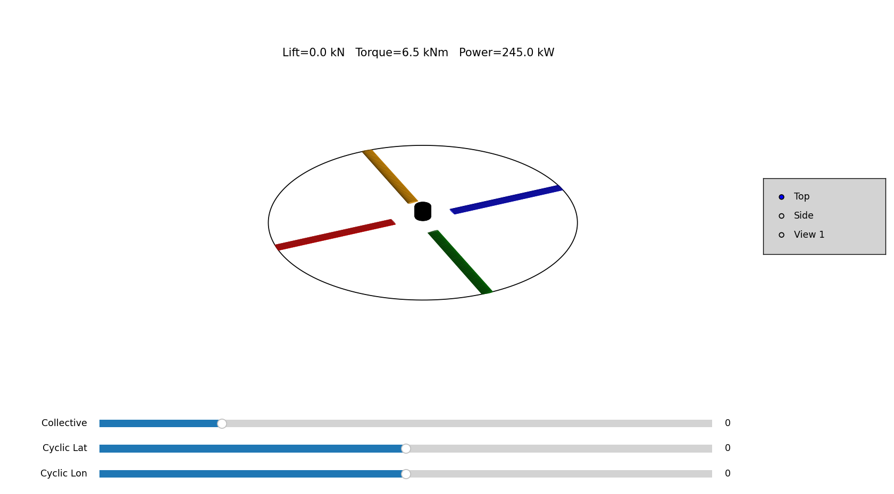

# rotor_simulator
Simulation of a helicopter main rotor using python programming language
# Parameters to modify: 
"R"            -> radius of the rotor

"Nb"           -> number of blades

"RPM" 

"rho":

"chord":       -> root chord dimensions (in v1.0 =tip chord)

"CLalpha"      -> CL_alpha

"Cd0"          -> CD_0

"collective"   -> value in degree of the collective

"cyclicLat":   -> value in degree of the lateral cyclic

"cyclicLon":   -> value in degree of the longitudinal cyclic

"hover":       -> set True for hovering condition ( it set the value of the foward speed to zero)

"forwardSpeed" -> foward speed (considered only if hover is False)

"dt":          -> temporal step

"simTime":     -> simulation time

